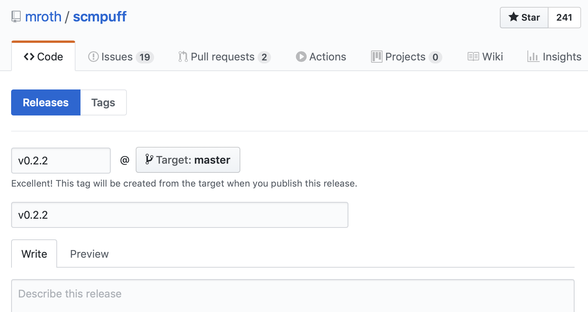

# bump :sunflower:

Simple, cross-platform CLI tool to help draft a [GitHub Release] for the next
[semantic version] of your project.

- Zero runtime dependencies (not even git).
- Auto-detects current repo if in cloned repository.
- Can work without any API authorization at all.

This is intentionally designed to work with the GitHub web site interface for
drafting releases, and does not even require you to have the source code checked
out locally.

[GitHub Release]: https://help.github.com/en/articles/about-releases
[semantic version]: https://semver.org

## Usage

```
$ bump --help
Usage: bump <owner> <repo>

If you are in a git repository that has been cloned from GitHub, owner and
repo args can be omitted, in which case they will be inferred from the remote
origin.

Flags:
    --no-open           Do not automatically open publish URL in browser.
    --verbose, -v       Verbose output.
    --version           Print version and exit.
    --help              Print help and exit.

Environment:
    $BUMP_NO_OPEN       Global default for --no-open
    $BUMP_VERBOSE       Global default for --verbose
    $GITHUB_TOKEN       Optional, will use if present to access private repos
```

Doing this:


:arrow_right: Automatically opens this in your browser:



Afterwards you have a local checkout of the repository, you may wish to do `git
fetch` to pull all remote tags to your system. :eyes:

## Installation

:warning:
<small>
_Pre-release software! API or even the package name might change (Any
better ideas for the name btw?)_
</small>

Download from the [Releases page](https://github.com/mroth/bump/releases) and
put somewhere in your `$PATH`.

macOS Homebrew users can `brew install mroth/formulas/bump`.

## Comparison

Unlike many of these release tools, bump is currently intended to support
workflows where rather than pushing tags locally, new releases are primarily
drafted via the Github Releases web interface (all the easier to drag your
animated GIFs in, and whatnot.)

This may not be the correct workflow for your project! In particular, it really
works best in environments where there is not a version number file that stored
in version control itself (Node NPM, Rust Cargo), but rather those where the git
tags themselves manage the versioning (Go modules libraries, sbt-git, etc.)

Some related tools I found in looking at this you may wish to consider as
alternatives.

- [sindresorhus/np] For NPM projects, this is really good. We've adopted it for
  all our JS native projects at @openlawteam, in conjunction with
  `--no-publish`.
- [goreleaser] For Go projects, this tool is super good. In fact, it works well
  in partnership with `bump`, the two tools can be complimentary for certain
  workflows (and I use goreleaser to package bump itself!).
- [zeit/release] Very close to what we wanted, but it does the tag/commit
  locally and pushes to GitHub before drafting the release, and requires API
  authorization to draft the release message.

[sindresorhus/np]: https://github.com/sindresorhus/np
[goreleaser]: https://goreleaser.com
[zeit/release]: https://github.com/zeit/release

## TODOs

- Check for `GITHUB_TOKEN` environment variable and use it if it exists,
  allowing for retrieving info on private repositories. (written, should work,
  but not tested yet.)
- Verify if need a no-emoji option for Linux users?
- Automatic changelog generation (in progress)
- Possibly add support for semver pre-release increments? Maybe standardize node
  style via examples on https://github.com/rtsao/npm-publish-prerelease
